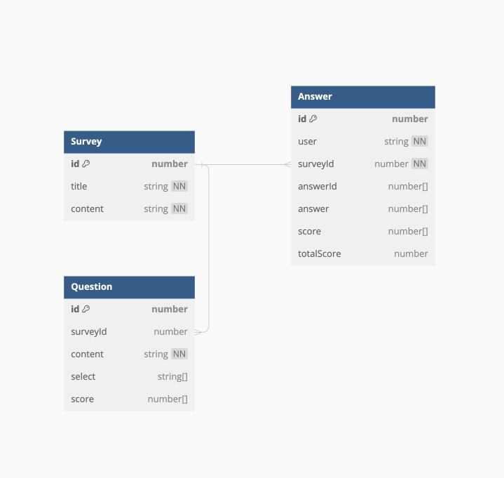

# 마음연구소 코딩테스트 과제

## 사용 기술

Typescript, Nest.js, GraphQL, typeORM, PostgreSQL, Winston

## 서비스 설명

- 객관식 설문지의 데이터베이스 설계
- 답변별 점수가 존재하며, 설문지는 답변을 체크할 수 있습니다.
- 답변의 총점을 확인할 수 있습니다.

## 서버 동작 방법

1. git clone 진행
2. terminal에 docker-compose build 명령어 입력
3. terminal에 docker-compose up -d 명령어 입력

## ERD

- 선택지의 경우, Entity를 통해 생성할 시 DB의 Index 크기가 매우 커진다는 단점이 존재
- Postgres의 장점인 데이터 Type의 Array를 이용하여 Select, score, answer를 저장

## API 명세서

[API 명세서 Notion](https://hangjo0610.notion.site/f856e587a3ea4b5da2e128857c67fd89?v=3f5791dcca8e401c8a0111bd544b6157&pvs=4)

- 설문지 CRUD
- 문항 CRUD (문항 CRUD 내 선택지 CRUD를 구현)
- 답변 CRUD
- 설문지 완료 -> 답변 조회로 대체
- 완료된 설문지 확인 -> 답변 조회로 대체하였으며, ResolveField를 통해 survey 확인 가능

## Refactoring 내역

### Logger 관련 Refactor

1. **Logger 기능이 main.ts와 APP rootModule에 동시에 적용된 점을 확인하고, Main.ts에만 적용하도록 수정**
   - Application Bootstrap 시 log도 남겨놓기 위하여 Main.ts에 Logger 적용
   - 현재 NestJS LogLevel을 사용중, 추후 Custom LoggerService를 제작하여 Winston의 Log Level 적용 예정
1. **Error를 명시적으로 확인할 수 있도록 errorCode 도입**
   - 명시적으로 errorCode에 대해 작성함으로써 각각의 예외 상황을 명확하게 구분할 수 있는 장점
   - Custom Error 작성을 통해 예외 처리 로직의 가독성 향상
   - 코드의 재사용성 확보
1. **interceptor를 통한 사용자 정보 Logging**
   - Ip, Path, fieldName 저장 진행
   - 추후 Brute force 공격을 대비하기 위함이며, Throttler Module을 사용하여 Rate limit 예정
1. **Custom ExceptionFilter를 통하여 Application에서 처리되지 못한 예외 처리 Logging 기능 적용**
   - 명시적 예외처리인 경우 Logger Level warn으로 지정하여 저장
   - app에서 처리되지 않은 에러처리의 경우 Error로 남겨두며, StackTrace를 남겨 신속한 대응을 할 수 있도록 Log에 기록
   - 추후 slack이나 APM Tool(Sentry, Elastic APM)을 적용하여 알람 기능 및 Logger 대체 예정

### Survey 관련 Refactor

1. **복수답안 문항 제작(Doing)**
   1. JSON.parse, JSON.stringify를 통한 직렬화 전략
   - answer Array 내 복수 답안은 Array로 구현 (Ex: answer [1,2,3,[1,2],1])
   - GraphQL Custom Scalar type 구현
   - https://docs.nestjs.com/graphql/scalars#scalars
   - https://www.apollographql.com/docs/apollo-server/schema/custom-scalars/#example-the-date-scalar
